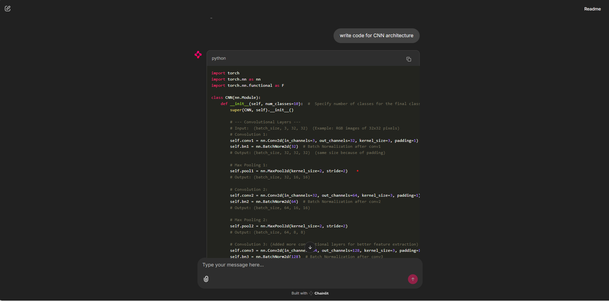

# Agents Using Chainlit and OpenAI Agent SDK

# Building a Conversational AI Agent with Chainlit & OpenAI Agent SDK! 🤖💬

#### 1- A simple AI Assistant 
#### 2- A Deep Learning Expert Agent built using Chainlit and OpenAI’s Agent SDK! 🎉 This AI-powered assistant is designed to provide real-time insights into Deep Learning concepts, frameworks, and best practices through an interactive chat interface.

# What’s Special About It?
✅ Conversational AI with Memory – Retains context across interactions
✅ Streaming Responses – Provides real-time AI-powered answers
✅ Deep Learning Expertise – Answers questions on CNNs, RNNs, Transformers & more
✅ Customizable & Scalable – Easily extendable for multi-agent applications

# Whether you need help with Neural Networks, PyTorch, TensorFlow, or Hyperparameter Tuning, this AI assistant is ready to chat!

### Tech Stack:
🛠️ Chainlit – For real-time conversational UI
🤖 OpenAI Agent SDK – To create and manage AI agents
🔥 AsyncOpenAI API – For efficient API calls
🧠 Gemini-2.0 Model – For enhanced reasoning

